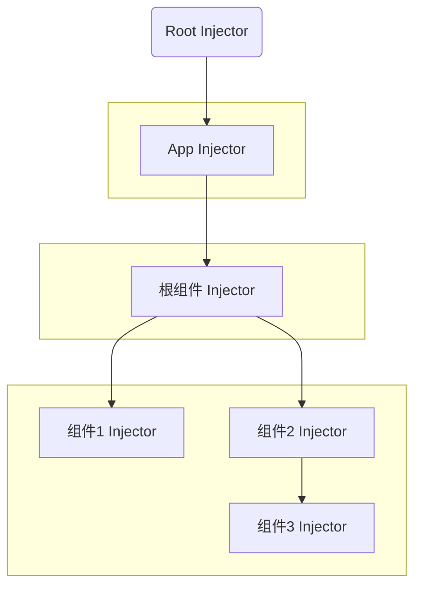
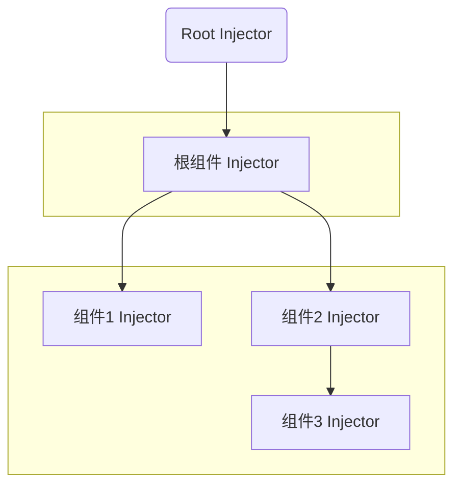
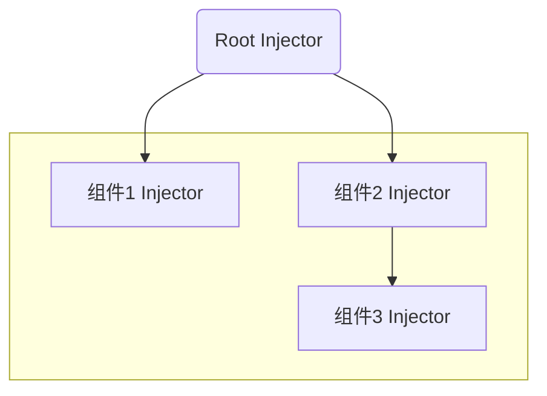
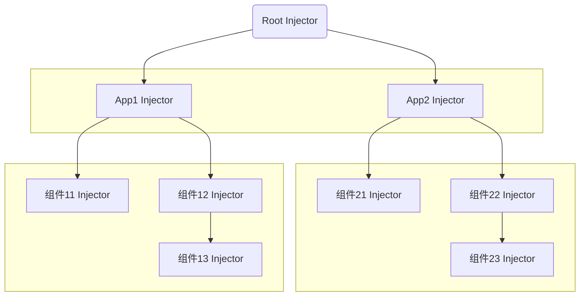
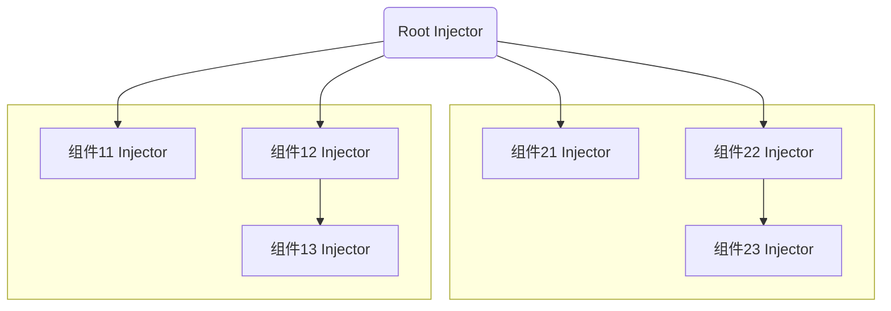

# 组件与 Injector

## 名词解释

**组件：** 就是指 vue 组件

**Injector：** 是指`@kaokei/di`提供的依赖注入容器

**根组件：** 是指传递给`createApp`的第一个参数，一般是`App.vue`

**根组件 Injector：** 是指根组件对应的那个 Injector，也就是在根组件中调用`declareProviders`关联的那个 Injector

**App：** 也称为应用，是指`createApp`函数的返回值

**App Injector：** app 对应的 Injector，理论上应该提供但实际上本库没有提供这种 Injector，对比根组件 Injector，它应该是在应用创建之前存在的

**Root Injector：** 也称为根 Injector，是指`@kaokei/use-vue-service`自带的默认的 Injector

::: tip 重要
在其他文档中，刻意忽略了根组件和应用的区别。也刻意忽略了根组件 Injector，App Injector 和 Root Injector 的区别。
:::

## 单个应用

这里单个应用的意思是指只调用一次`createApp`创建一个应用。可以说绝大多数项目只会有一个应用。

组件和 Injector 的对应关系是一个组件可以对应 1 个或者 0 个 Injector。

在其他文档中，我会经常提到根组件就是对应的根 Injector，实际上是不准确的。根组件就是普通的组件，只不过是处在最顶层的位置。只要在根组件中调用`declareProviders`就会生成一个相关联的 Injector，这个 Injector 就是根组件的 Injector。

实际上，当我们引入本库时，就已经自带了一个根 Injector 了。也就是说`@kaokei/use-vue-service`自带了一个默认 Injector。这个根 Injector 并没有和根组件绑定，而且是先于根组件存在的。

后续当我们在组件中调用`declareProviders`时，如果没有找到父级 Injector，就会把自带的根 Injector 当作父级 Injector。所以最终形成的 Injector 树的根节点就是本库自带的那个根 Injector。

### 理想中的 Injector 结构



### 实际中的 Injector 结构



<center>图1：有根组件Injector结构</center>

---



<center>图2：没有根组件Injector结构</center>

---

观察上方 3 张图可以发现目前本库并没有实现所谓的 App Injector。又因为绝大多数项目中只会有**一个** createApp 创建的 vue 应用。所以把 Root Injector 当作 App Injector 也是可以接受的。

同时注意到根组件的 Injector 可能有，也可能没有，但是这并不重要，因为有根 Injector 兜底。

::: tip
其他文档中提到的全局服务，默认情况下也是会存储在这个根 Injector 中，因为并没有所谓的 App Injector。
:::

::: tip
上面的关系图展示了 Injector 结构树，所以省略了很多没有关联 Injector 的组件节点，因为并不是每一个组件都会关联一个 Injector。
:::

## 多个应用

这里多个应用的意思是指多次调用`createApp`创建多个应用。虽然很少见有这种做法，但是理论上是可以这么做的。

根组件对应的 Injector 应该是应用级别的 Injector，假设我们的项目非常复杂，是由多个 vue 应用组成的，即多次调用了`createApp`方法。每个`createApp`创建的 vue 应用都应该有自己的 App Injector。当然这些 App Injector 也是自带的根 Injector 的子 Injector。以上只是纯粹理论分析。

### 理想中的 Injector 结构



### 实际中的 Injector 结构



上方 2 张图中并没有展示根组件对应的 Injector，因为根组件对应的 Injector 和普通组件的 Injector 并没有什么区别，可以存在，也可以不存在，不影响分析。

可以明显的发现在多 App 项目中，由于缺少 App Injector 会导致不同的 App 的全局服务只能出现在 Root Injector，缺少数据隔离性，而且 App 的服务的生命周期和 App 不能保持一致。

::: tip
从代码完整性角度来看，我应该提供 App Injector 的实现，从而可以支持更加复杂的业务场景。
但是我并不想因为比较少见的业务场景而增加代码复杂度，因为绝大多数项目都只有一个`createApp`应用，此时把 Root Injector 当作 App Injector 是完全可以接受的。
:::

## 解决方案

### 方案一

使用根组件 Injector 代替 App Injector，也就是在各个 createApp 创建的应用对应的`App.vue`组件中使用 declareProviders 声明 token 和服务的关联关系。

这是最容易想到的方案，可以做到数据隔离，但是这不是理想中的 App Injector，因为它要求必须在应用创建之后才能生效。

### 方案二

实现一个 vue 插件，通过插件来配置 providers，可以实现在 app 创建之前生效，准确来说是 mount 之前。

```ts
// 定义插件
import {
  getInjector,
  DEFAULT_INJECTOR,
  INJECTOR_KEY,
} from "@kaokei/use-vue-service";

// 实现插件
export function declareAppProviders(providers: any[]) {
  return function (app: any) {
    const currentInjector = getInjector(providers, DEFAULT_INJECTOR);
    app.provide(INJECTOR_KEY, currentInjector);
  };
}
```

```ts
// 使用插件
// 定义providers数组
const providers = [
  SomeService,
  {
    provide: SomeToken,
    useClass: AnotherService,
  },
];
// 使用插件配置providers
// 这里会在app.context.providers中关联一个App Injector
// 注意这里的Injector并不是关联到某一个组件而是app，我称之为App Injector
app.use(declareAppProviders(providers));
app.mount("#app");
```

::: tip
这个方案看起来要比方案一要好一些，但是实际上并没有差别，这里是指方案一需要等到应用创建完成之后才能生效，而方案二看似是在创建应用之前就能配置 providers，但是这里并没有提供一个函数在创建应用之前就能获取对应的服务。

对比`declareRootProviders/useRootService`，这一对方法是完整的可以在创建应用之前使用的。所以我们还缺少`useAppService`这个方法。
但是`useAppService`的实现相对来说比较麻烦一些，而且对用户的使用也有更多的要求和限制。
:::

## 鸡・蛋问题

可以[参考这里](https://www.zhihu.com/question/30301819)介绍了非常有意思的鸡・蛋问题。

这里也是有类似的鸡蛋问题，正常逻辑是需要先通过 declareProviders 配置 token 和服务的关联关系。然后通过 useService 获取对应的服务。

但是 declareProviders 要求只能在组件内部调用，也就是要求 createApp 之后才能使用 declareProviders/useService 这一套逻辑。
但是如果我们在调用 createApp 之前有依赖服务，就要先支持 declareProviders/useService 这一套逻辑。显然这里就出现了死循环。

在[应用服务化](/pages/3a3a6b/)中我们有介绍可以通过 declareRootProviders/useRootService 来解决这个死循环，这是最简单的方案，但并不是最理想的解决方案。

后来我对比了 Angular 中的实现，关键在于从底层消除循环依赖，一定有一个最早执行的可控代码。

比如我定义了一个`bootstrapApp`的方法，所有的服务的初始化都要在这个方法执行之后，也就是说不会存在执行 bootstrapApp 之前还依赖了其他服务的场景。

## 最终实现方案

```ts
// 定义bootstrapApp函数
import {
  getInjector,
  DEFAULT_INJECTOR,
  INJECTOR_KEY,
  getServiceFromInjector,
} from "@kaokei/use-vue-service";

export function bootstrapApp(init: any) {
  let appInjector;
  const declareAppProviders = (providers: any[]) => {
    const appInjector = getInjector(providers, DEFAULT_INJECTOR);
    return function (app: any) {
      app.provide(INJECTOR_KEY, appInjector);
    };
  };
  const useAppService = (token: any, options?: any) => {
    return getServiceFromInjector(appInjector, token, options);
  };
  init(declareAppProviders, useAppService);
}
```

```ts
// 使用bootstrapApp函数
bootstrapApp(function (declareAppProviders, useAppService) {
  // 定义providers数组
  const providers = [
    SomeService,
    {
      provide: SomeToken,
      useClass: AnotherService,
    },
  ];
  // 使用插件配置providers
  // 这里会在app.context.providers中关联一个App Injector
  // 注意这里的Injector并不是关联到某一个组件而是app，我称之为App Injector
  app.use(declareAppProviders(providers));
  // 有需要的话可以提前获取服务
  const someService = useAppService(SomeService);
  // 并在创建应用之前就能调用服务的方法
  someService.doSomething();
  app.mount("#app");
});
```

::: tip
注意`declareAppProviders`只能调用一次，否则 appInjector 就被覆盖了。`useAppService`必须在`declareAppProviders`后面调用。
:::

::: tip
以上代码只是作为参考，绝大多数项目是完全不需要这种实现方案的，直接使用 Root Injector 就可以了。
:::
