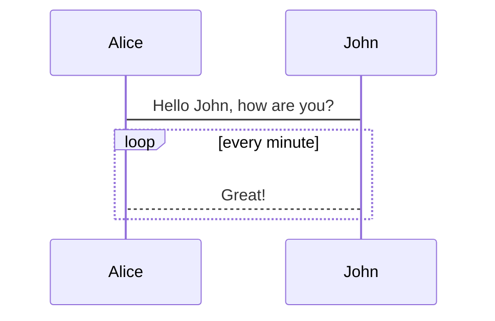

# markdown 示例文章

# 一级标题

一级标题应该只有一个，而且第一个一级标题不会显示出来。这里其实是第二个一级标题。

## 二级标题

注意到只有二级标题才有底部横线。

### 三级标题

注意到侧边栏只会显示到三级标题。

#### 四级标题

##### 五级标题

###### 六级标题

:::details 标题

```markdown
# 一级标题

## 二级标题

### 三级标题

#### 四级标题

##### 五级标题

###### 六级标题
```

:::

## 字体

_斜体文本_
_斜体文本_

**粗体文本**
**粗体文本**

**_粗斜体文本_**
**_粗斜体文本_**

:::details 字体

```markdown
_斜体文本_
_斜体文本_

**粗体文本**
**粗体文本**

**_粗斜体文本_**
**_粗斜体文本_**
```

:::

## 分割线+删除线+下划线

`---`可以画一个全宽的横线。注意到上面的横线是二级标题自带的横线，下面才是我画的横线。

---

~~BAIDU.COM~~

<u>带下划线文本</u>

:::details 分割线

```markdown
---

~~BAIDU.COM~~

<u>带下划线文本</u>
```

:::

## 列表

分为有序列表和无序列表

- 第一项
  - 第一项嵌套的第一个元素
  - 第一项嵌套的第二个元素
- 第二项
  - 第二项嵌套的第一个元素
  - 第二项嵌套的第二个元素
- 第三项
  1. 第 3 项嵌套的第 1 个元素
  2. 第 3 项嵌套的第 2 个元素
  3. 第 3 项嵌套的第 3 个元素

:::details 列表

```markdown
- 第一项
  - 第一项嵌套的第一个元素
  - 第一项嵌套的第二个元素
- 第二项
  - 第二项嵌套的第一个元素
  - 第二项嵌套的第二个元素
- 第三项
  1. 第 3 项嵌套的第 1 个元素
  2. 第 3 项嵌套的第 2 个元素
  3. 第 3 项嵌套的第 3 个元素
```

:::

## 引用

**嵌套引用**

> 最外层
>
> > 第一层嵌套
> >
> > > 第二层嵌套

**区块中使用列表**

> 区块中使用列表
>
> 1. 第一项
> 2. 第二项
>
> - 第一项
> - 第二项
> - 第三项

**列表中使用区块**

- 第一项
  > 菜鸟教程
  > 学的不仅是技术更是梦想
- 第二项

:::details 引用

```markdown
> 最外层
>
> > 第一层嵌套
> >
> > > 第二层嵌套
```

:::

## 代码

这是内联代码：`printf()` 函数

以下是代码块。[这里是合法的语言列表](https://prismjs.com/#languages-list)

常见语言代码：`markdown` `js` `css` `html` `bash` `ts`

```javascript {2}
$(document).ready(function () {
  alert("RUNOOB");
});
```

:::details 代码

````markdown
`printf()`

```javascript {2}
$(document).ready(function () {
  alert("RUNOOB");
});
```
````

:::

## 链接

[百度地址](https://www.baidu.com/)

<https://www.baidu.com/>

:::details 链接

```markdown
[百度地址](https://www.baidu.com/)

<https://www.baidu.com/>
```

:::

## 高级链接

这个链接用 1 作为 Google 网址变量 [Google][1]

这个链接用 baidu 作为网址变量 [baidu][baidu]

这个链接用 kaokei 作为图片网址变量 [kaokei][kaokei]

然后在文档的结尾为变量赋值（网址）

[1]: https://www.google.com/
[baidu]: https://www.baidu.com/
[kaokei]: https://cdn.jsdelivr.net/gh/kaokei/static-cdn/logo/white/logo@512.png

:::details 高级链接

```markdown
这个链接用 1 作为 Google 网址变量 [Google][1]

这个链接用 Baidu 作为网址变量 [Baidu][baidu]

然后在文档的结尾为变量赋值（网址）

[1]: https://www.google.com/
[baidu]: https://www.baidu.com/
```

:::

## 图片


:::details 图片

```markdown


```

:::

## 表格

| 左对齐   | 居中对齐 | 右对齐 |
| :------- | :------: | -----: |
| 单元格 1 |  单元格  | 单元格 |
| 单元格 2 |  单元格  | 单元格 |
| 单元格 3 |  单元格  | 单元格 |
| 单元格 4 |  单元格  | 单元格 |

:::details 表格

```markdown
| 左对齐   | 居中对齐 | 右对齐 |
| :------- | :------: | -----: |
| 单元格 1 |  单元格  | 单元格 |
| 单元格 2 |  单元格  | 单元格 |
| 单元格 3 |  单元格  | 单元格 |
| 单元格 4 |  单元格  | 单元格 |
```

:::

## 支持 HTML 元素

目前支持的 HTML 元素有：\<kbd> \<b> \<i> \<em> \<sup> \<sub> \<br> \<mark>等。

使用 <kbd>Ctrl</kbd>+<kbd>Alt</kbd>+<kbd>Del</kbd> 重启电脑

Vdoing 是一款简洁高效的<mark>知识管理和博客</mark>主题

:::details 支持 HTML 元素

```markdown
使用 <kbd>Ctrl</kbd>+<kbd>Alt</kbd>+<kbd>Del</kbd> 重启电脑

Vdoing 是一款简洁高效的<mark>知识管理和博客</mark>主题
```

:::

## 转义

**文本加粗**

\*\* 正常显示星号 \*\*

:::details 转义

```
**文本加粗**

\*\* 正常显示星号 \*\*

\ 反斜线

` 反引号

- 星号

_ 下划线

{} 花括号

[] 方括号

() 小括号

# 井字号

- 加号

* 减号

. 英文句点

! 感叹号
```

:::

## Emoji 表情

[Emoji 代码列表参考这里](https://gist.github.com/rxaviers/7360908)

[另一个 Emoji 代码列表](https://github.com/markdown-it/markdown-it-emoji/blob/master/lib/data/full.json)

去露营了！ :tent: 很快回来。

真好笑！ :joy:

:tada: :100:

:::details Emoji 表情

```markdown
去露营了！ :tent: 很快回来。

真好笑！ :joy:

:tada: :100:
```

:::

## 目录

[[toc]]

因为 vuepress-vdoing 会自动生成侧边栏，倒也不怎么需要这个了。

:::details 目录自动生成

```
[[toc]]
```

:::

## 自定义容器

目前支持这些容器：`tip` `warning` `danger` `note` `center` `details` `right` `theorem` `cardList` `cardImgList`

::: tip 自定义提示标题
这是一个提示
:::

::: warning 自定义警告标题
这是一个警告
:::

::: danger 自定义危险标题
这是一个危险警告
:::

::: note 自定义笔记标题
这是笔记容器，在 <Badge text="v1.5.0 +" /> 版本才支持哦~
:::

::: center 自定义居中标题

我是居中的内容

（可用于标题、图片等的居中）
:::

::: details 自定义详情标题
这是一个详情块，在 IE / Edge 中不生效
:::

::: right 自定义右浮动内容

我是右浮动的标题

[我是右浮动的链接](https://www.baidu.com/)
:::

::: theorem 牛顿第一定律
假若施加于某物体的外力为零，则该物体的运动速度不变。
::: right 自定义右浮动内容
来自 [维基百科](https://www.baidu.com/)
:::

## [卡片列表](https://doc.xugaoyi.com/pages/d0d7eb/#%E5%9B%BE%E6%96%87%E5%8D%A1%E7%89%87%E5%88%97%E8%A1%A8)

普通卡片列表容器，可用于`友情链接`、`项目推荐`、`诗词展示`等。

::: cardList

```yaml
- name: 麋鹿鲁哟
  desc: 大道至简，知易行难
  avatar: https://cdn.jsdelivr.net/gh/xugaoyi/image_store/blog/20200122153807.jpg # 可选
  link: https://www.cnblogs.com/miluluyo/ # 可选
  bgColor: "#CBEAFA" # 可选，默认var(--bodyBg)。颜色值有#号时请添加单引号
  textColor: "#6854A1" # 可选，默认var(--textColor)
- name: XAOXUU
  desc: "#IOS #Volantis主题作者"
  avatar: https://cdn.jsdelivr.net/gh/xaoxuu/assets@master/avatar/avatar.png
  link: https://xaoxuu.com
  bgColor: "#718971"
  textColor: "#fff"
- name: 平凡的你我
  desc: 理想成为大牛的小陈同学
  avatar: https://reinness.com/avatar.png
  link: https://reinness.com
  bgColor: "#FCDBA0"
  textColor: "#A05F2C"
```

:::

控制一行展示 2 个卡片。

::: cardList 2

```yaml
- name: 《静夜思》
  desc: 床前明月光，疑是地上霜。举头望明月，低头思故乡。
  bgColor: "#F0DFB1"
  textColor: "#242A38"
- name: Vdoing
  desc: 🚀一款简洁高效的VuePress 知识管理&博客(blog) 主题
  link: https://github.com/xugaoyi/vuepress-theme-vdoing
  bgColor: "#DFEEE7"
  textColor: "#2A3344"
```

:::

还可以展示为图文卡片列表。

::: cardImgList

```yaml
- img: https://cdn.jsdelivr.net/gh/xugaoyi/image_store/blog/20200529162253.jpg
  link: https://xugaoyi.com/
  name: 标题
  desc: 描述内容描述内容描述内容描述内容描述内容描述内容描述内容描述内容 # 描述，可选
  author: Evan Xu # 作者，可选
  avatar: https://cdn.jsdelivr.net/gh/xugaoyi/image_store/blog/20200103123203.jpg # 头像，可选
- img: https://cdn.jsdelivr.net/gh/xugaoyi/image_store/blog/20200530100256.jpg
  link: https://xugaoyi.com/
  name: 标题
  desc: 描述内容描述内容描述内容描述内容描述内容描述内容描述内容描述内容
  author: Evan Xu
  avatar: https://cdn.jsdelivr.net/gh/xugaoyi/image_store/blog/20200103123203.jpg
- img: https://cdn.jsdelivr.net/gh/xugaoyi/image_store/blog/20200530100257.jpg
  link: https://xugaoyi.com/
  name: 标题
  desc: 描述内容描述内容描述内容描述内容描述内容描述内容描述内容描述内容
  author: Evan Xu
  avatar: https://cdn.jsdelivr.net/gh/xugaoyi/image_store/blog/20200103123203.jpg
```

:::

## 徽章组件

Badge <Badge text="beta" type="warning"/> <Badge text="默认主题"/>

《沁园春·雪》 <Badge text="摘"/>

北国风光<Badge text="注释" type="warning"/>，千里冰封，万里雪飘。

> <Badge text="译文" type="error" vertical="middle"/>: 北方的风光。

:::details Badge

```markdown
<Badge text="译文" type="error" vertical="middle"/>
```

:::

## 外部标签


:::details 外部标签

```markdown


```

:::

## 流程图

[mermaidjs 流程图编辑器](https://mermaid-js.github.io/mermaid-live-editor/edit/)


